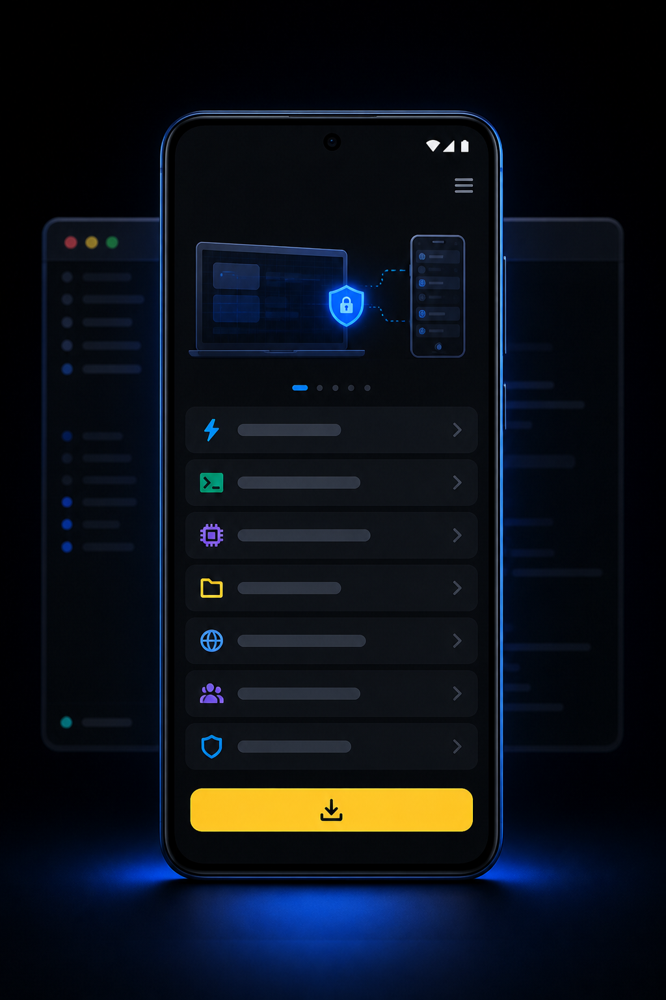

# Codex汉化增强版移动端

把电脑上的 Codex 工作现场带到手机上。即使首页还没有连接任何终端，也能先了解产品能力，再按引导完成安装、登录与远程连接。

## 一部手机，随时接手电脑上的任务

- 移动端远程使用，无需魔法
- 账号登录，无需魔法
- 实时汉化，热更新跟踪官方
- 一键接入国产模型，拒绝繁琐配置
- 双重统计，用量清楚可见
- 官方与国产模型自由切换
- 帮助社区，大神在线解答

## 下载与更新

Android 正式签名安装包和编译后的热更新资源统一从 [GitHub Releases](https://github.com/pluscodex888/codex-mobile-release/releases) 下载。每个正式版本同时提供 APK、Android OTA 资源包、OTA 清单和 SHA-256 校验和。

当前正式版：[Android v1.5.14 安装包与更新包](https://github.com/pluscodex888/codex-mobile-release/releases/tag/android-v1.5.14)。本仓库不提供调试签名安装包。

## 发布安全

本仓库只保存产品图文和运行制品，不发布应用源码。发布流程会阻断 JavaScript/TypeScript、source map、原生源码、依赖目录、Git 数据、环境文件、密钥、证书、keystore 和签名配置。

热更新包只包含 Hermes 编译字节码、运行时图片/字体、清单与校验和。完整规则见 [RELEASE_POLICY.md](RELEASE_POLICY.md)。
